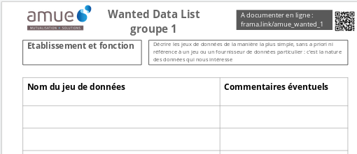
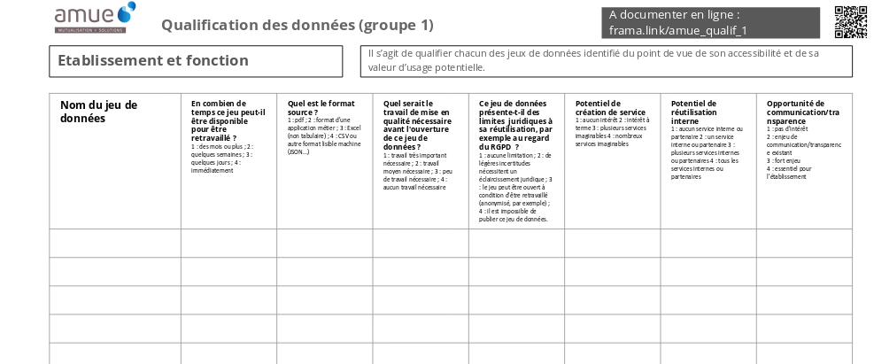

layout: true

`r paste0("
", params$event, " 

")` 

---

class: center, middle

Ces slides en ligne : `r paste0("http://datactivist.coop/", params$slug, "/conducteur")`

Sources : `r paste0("https://github.com/datactivist/", params$slug)`

Les productions de Datactivist sont librement réutilisables selon les termes de la licence [Creative Commons 4.0 BY-SA](https://creativecommons.org/licenses/by-sa/4.0/legalcode.fr).

 
 

---
## La "wanted data list"

Durée : 30 minutes, à remplir plutôt individuellement

groupe 1 => [frama.link/amue_wanted_1](https://frama.link/amue_wanted_1)

groupe 2 => [frama.link/amue_wanted_2](https://frama.link/amue_wanted_2)

groupe 3 => [frama.link/amue_wanted_3](https://frama.link/amue_wanted_3)

.center[]

---
## Qualifier les données

Durée : 45 minutes, à remplir en groupes

groupe 1 => [frama.link/amue_qualif_1](https://frama.link/amue_qualif_1)

groupe 2 => [frama.link/amue_qualif_2](https://frama.link/amue_qualif_2)

groupe 3 => [frama.link/amue_qualif_3](https://frama.link/amue_qualif_3)

.center[]

---
## Restitution de la matrice produite par le groupe

groupe 1 => [frama.link/amue_restit_1](https://frama.link/amue_restit_1)

groupe 2 => [frama.link/amue_restit_2](https://frama.link/amue_restit_2)

groupe 3 => [frama.link/amue_restit_3](https://frama.link/amue_restit_3)

**Vos réactions ?**

---
## Conclusion en plénière

- Restitution par les rapporteurs (3-4 mn par groupe)

- Présentation de la matrice globale ([frama.link/amue_restit](https://frama.link/amue_restit))

- Restitution rapide des matrices de prise de décision

---
class: inverse, center, middle

# Merci !

Contacts : 

[joel@datactivist.coop](mailto:joel@datactivist.coop)

[david.rongeat@amue.fr](mailto:david.rongeat@amue.fr)

